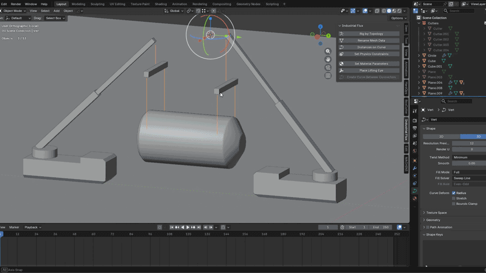

# Industrial Flux for Blender

Production tools for Blender focused on industrial visualization, Digital Twins, heavy lifting simulations and technical workflow automation.

---

## Overview

Industrial Flux for Blender is a collection of production tools developed to automate industrial workflows and reduce repetitive technical tasks.

The add-on was created from real production needs, simplifying complex workflows for lifting studies, Digital Twin preparation and industrial visualization.

---

## Featured Workflow

**Instances on Curve + Set Physics Constraints**

Instances on Curve automatically creates a procedural sequence of rigid bodies along a curve, allowing quick adjustment of spacing, size and element count.

Set Physics Constraints automatically generates and configures the complete constraint chain, replacing a manual setup that would normally require configuring dozens of constraints individually.

---

## Current Modules

- Rig by Topology
- Rename Mesh Data
- Instances on Curve
- Set Physics Constraints
- Set Material Parameters
- Place Lifting Eye

---

## Future Development

- Improved documentation
- Additional demonstrations
- Modular architecture
- Unreal Engine integration
# Industrial Flux for Blender

Production tools for Blender focused on industrial visualization, Digital Twins, heavy lifting simulations and technical workflow automation.

---

## Overview

Industrial Flux for Blender is a collection of production tools developed to automate industrial workflows and reduce repetitive technical tasks.

The add-on was created from real production needs, simplifying complex workflows for lifting studies, Digital Twin preparation and industrial visualization.

---

## Featured Workflow

**Instances on Curve + Set Physics Constraints**

Instances on Curve automatically creates a procedural sequence of rigid bodies along a curve, allowing quick adjustment of spacing, size and element count.

Set Physics Constraints automatically generates and configures the complete constraint chain, replacing a manual setup that would normally require configuring dozens of constraints individually.

---

## Current Modules

- Rig by Topology
- Rename Mesh Data
- Instances on Curve
- Set Physics Constraints
- Set Material Parameters
- Place Lifting Eye

---

## Future Development

- Improved documentation
- Additional demonstrations
- Modular architecture
- Unreal Engine integration
- Expanded lifting simulation tools